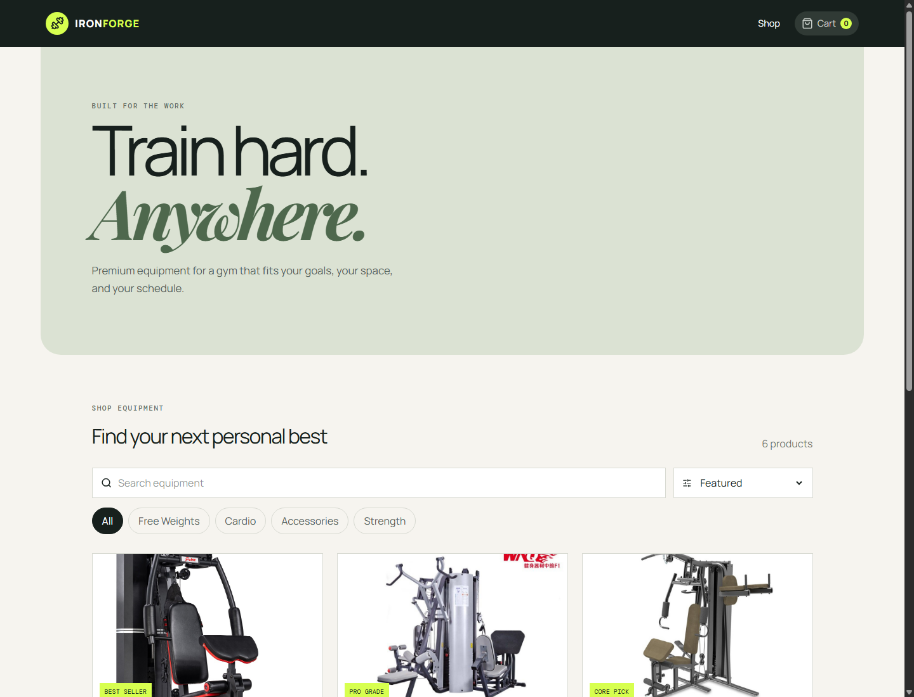
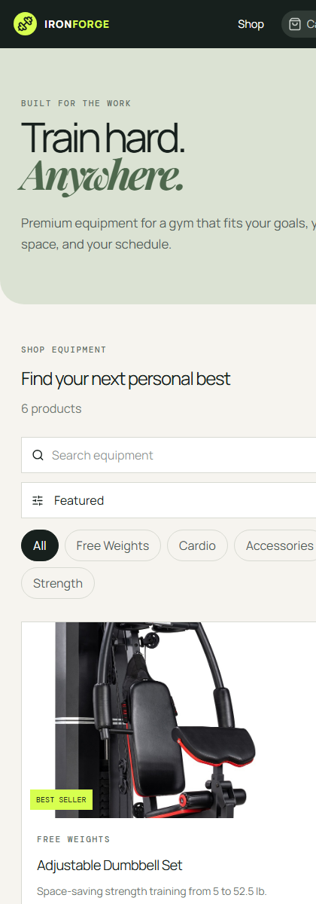
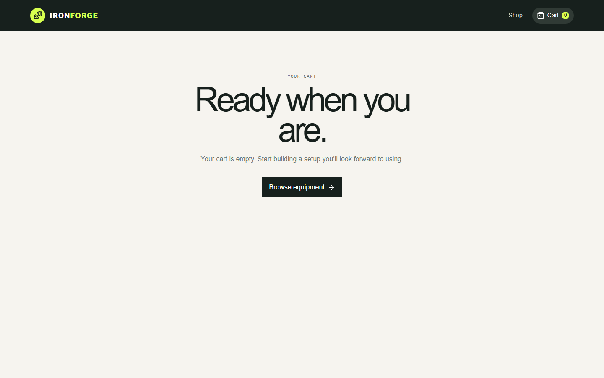

# GymGrid

GymGrid is a responsive React storefront for browsing and buying home-gym equipment. It uses local product data and keeps the shopping cart available after a browser refresh, so visitors can search, filter, and manage an order without a backend or payment flow.

## Features

- Responsive catalog with six gym-equipment products and local images
- Keyword search, category filtering, price/rating sorting, and no-results state
- Props-driven reusable components and properly keyed product lists
- Cart route with quantities, removal, live totals, and item count
- Product quick-view modal with specifications and keyboard Escape support
- Saved-gear wishlist and cart persistence with `localStorage` and `useEffect`
- Controlled search, sort, and promo-code form inputs
- Premium shipping announcement and customer-care footer

## Technology

React, Vite, React Router, React Toastify, Lucide React, CSS, and localStorage.

## Run locally

```bash
npm install
npm run dev
```

Open the URL printed by Vite (normally `http://localhost:5173`). Use `npm run build` for a production build.

## Screenshots







## Known limitations

Products are local mock data and checkout is visual only. Promo code `FORGE10` demonstrates controlled form handling but does not change the total.
